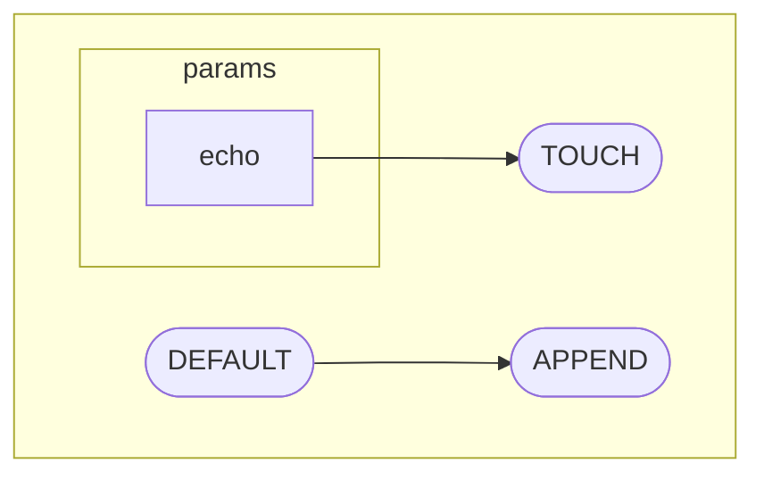

# mre

Run with: 

```
nextflow run .
```

or with

```
nextflow run . --echo "this is a message"
```

Mermaid diagram: 


```mermaid
flowchart TB
    subgraph " "
    subgraph params
    v0["echo"]
    end
    v1([TOUCH])
    v3([DEFAULT])
    v5([APPEND])
    v0 --> v1
    v3 --> v5
    end
```